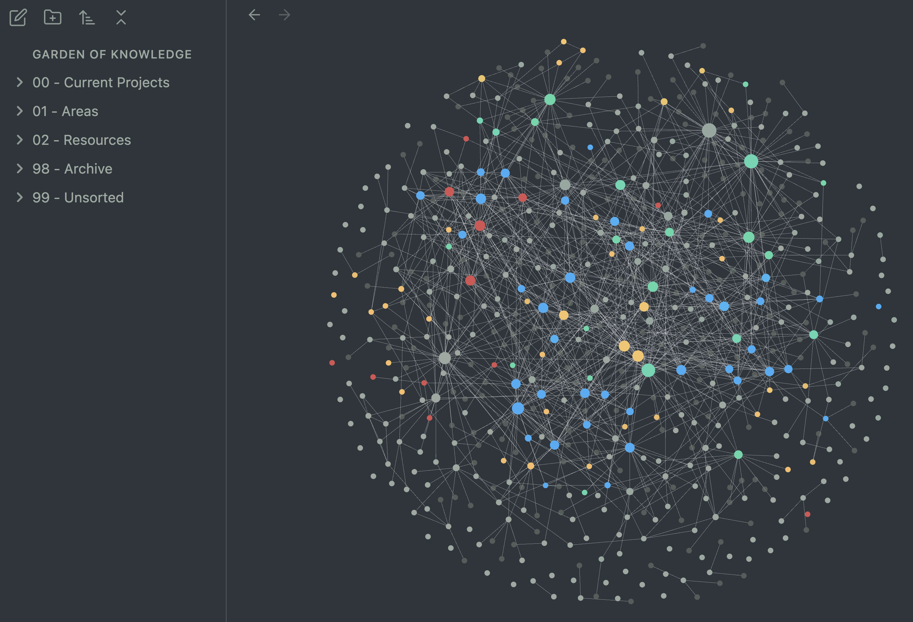
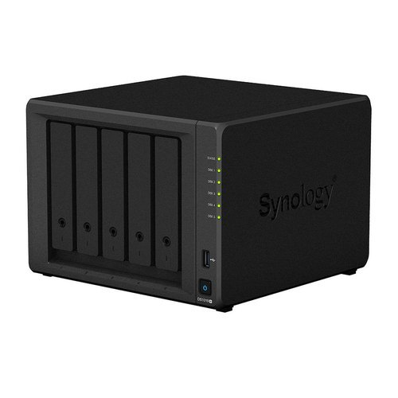
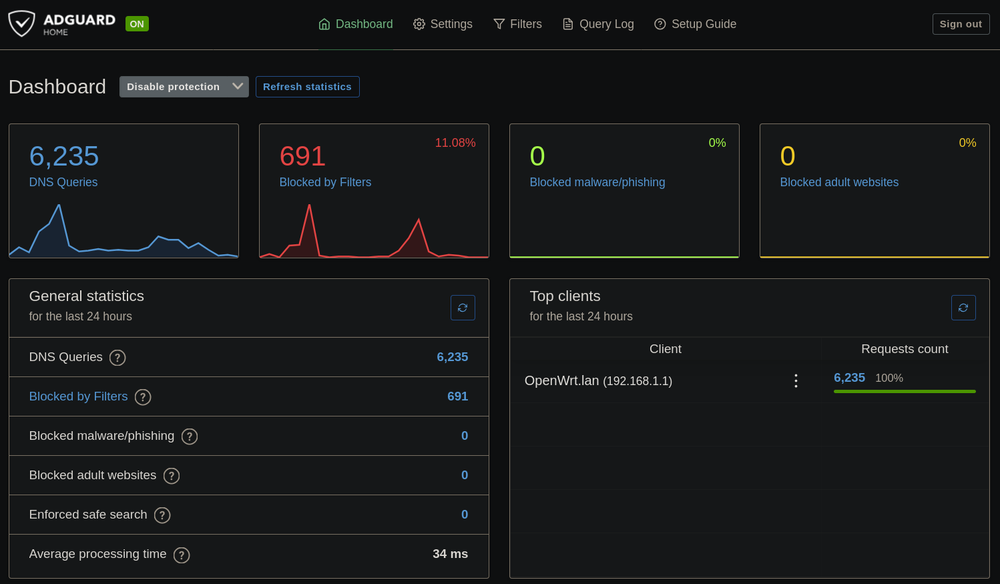

It started with my new year resolution in 2025: I am going to be more organized! As I was sipping cold brew at the coffee shop, I started jotting down ideas to become more organized. First, diligent note taking. Whether it's my ordinary meal at Google cafeteria, Wednesday soccer games or dumb ideas of my own, I decided to take notes. This is not a new idea for me. I often bought a year journal only to fill the first month or two. Rest 10 months? Who knows what happened other than me being lazy. I wanted to fix this systematically. Maybe I should not buy a book with dates printed, and do this digitally. Of course, this led me to looking at 10 different note taking apps, and how people use the features to organize their notes. After some light research, I discovered a popular method derived from a book "Building a Second Brain". I have not read the book, but looked into the PARA method. The PARA is abbreviation of these four words: Project, Area, Resource, Archive.
- Project: Short-term efforts with due dates which you are working on now. (ex. building a self-hosted server)
- Area: Long-term responsibilities you want to manage over time (ex. Finance)
- Resource: Topics or interests that may be useful in the future (ex. Note-taking)
- Archives: Anything that is no longer active, but saving for future reference (ex. Find a rental house)

This was an interesting idea as I always categorized notes by dates or topics. This changed my view on making notes more flexible based on my priorities and re-purposing my notes to focus on the current projects with long term goals. I chose [Obsidian](https://obsidian.md/) for note-taking app to set this up. People go crazy with the graph interlinking their notes, but I have no interest in that (*yet*). 
Going back to the ideas to become more organized, I wanted to evaluate my current online services and data. With advancement of AI, data is becoming more and more important. As AI can consume data exponentially faster than any human, AI companies will probably run out of public data to train their models. Then, what happens? Do we declare that AI model training is complete? Definitely not. These companies may perhaps start to use or sell private data acquired from their users to keep the training steady. You could argue that this was always the case even before AI. True. I genuinely believed that the technology helped society to better connect and made people's daily lives easier at the cost of their privacy. For example, Instagram kept me in touch with people in Korea with pictures of their daily lives; Twitter helped me relay the disaster updates to my family to prepare for the evacuation. However, as I observe many AI models racing to get better ELO, I still struggle to see how this will change my daily lives. Maybe I am just behind. But it is not a terrible idea to not use a technology which you don't see the benefit of.

Another concern was the data dependency. Taking photos has been essential to logging my life. In the old days, I would print them out,  put them in the photo albums and forget about it until I randomly decide to dust it out from my bookshelf. Now, the whole experience happens on Google Photos. Not only it is convenient, but also it takes you down on memory lane with their "5 years ago today..." notifications. With these embedded features that I like, I happily paid for Google One data subscription to sync all my photos. But this also means that I am solely paying and relying on Google to manage photos of my life. Don't get me wrong; I do trust Google (*for now*). I realized this is not future-proof. The data size will continue to grow as I take more pictures. I would need to subscribe for higher tiers for more storage. Subscription fee could also increase in the future. To the extreme case, what if my Google account gets compromised? Or Google server goes down? I know. I am thinking myself into a corner with non-existent problems that can be solved by simply paying a few ten-dollar bills. But this was just enough to get me hooked on building a self-hosted database.

## Where do I even start?
I looked if there are apps that can mimic what I do with my online services: Keeping photos, tracking my budget spending, file sharing, etc. It turns out that I am not the only one! People already are compiling the list of free apps that can be hosted on their own servers: [Awesome-Selfhosted](https://github.com/awesome-selfhosted/awesome-selfhosted?tab=readme-ov-file) There are some cool apps:
- [Immich](https://immich.app/) - Google Photos lookalike solution for self-hosted photos and video management
- [Adventure Log](https://github.com/seanmorley15/AdventureLog) - Logging your adventures and seeing the pins on the map
- [Actual Budget](https://actualbudget.org/docs/) - Budget tracking app locally loading from QIF files
- and so many more!

Browsing down the list of apps, I was eager to install them and test it myself. As many of these apps are well-integrated in Linux, I backed up data from my Windows desktop and planned to flash it with Linux. But which Linux distro? There are so many options like Ubuntu, Pop!\_OS, Fedora, Arch, etc. The list keeps going on. In fact, there is a subreddit [r/DistroHopping](https://www.reddit.com/r/DistroHopping/) for the people who can never decide on which one to stick to. After one week of reading about many Linux distros and asking Perplexity to compare them, I decided to install Pop!\_OS. It allegedly was better for gaming compatibility. I can continue playing League of Legends! Installing it was super easy with a bootable USB setup. After the installation, I noticed that the graphics was a bit funky. Google authentication window was blacked out; the computer will not turn off after shutting it down. Light research told me that Linux kernel and Nvidia graphics card don't work well together. Fortunately, there are graphics drivers that can alleviate some problems. But I still experience computer not fully turning off its power from time to time, and more importantly, I cannot run League of Legends! Then, I remembered a comment that installing Linux helped one from a LoL addiction. Every time I tried to troubleshoot, I had to keep turning on and off my computer, so I called it good enough for now. Maybe it is time to say goodbye to my RTX 980 and get an AMD GPU...

Did you notice that I am not even close to running any apps? Yes, you are witnessing my time sink. I am afraid to say this is only the beginning....

I got my Linux machine working. Let's install some apps! Just download the install file and run it right? No. Installation page comes with multiple different methods: running some *curl* command to grab it from http url, docker, github, etc. What do these all mean? What the heck is a docker? At this point, I am too tired to read all these, and I just want to see something that works to give me some hope. Without knowing much, I installed docker, then with a few commands(Ctrl + C, Ctrl + V), I installed the actual budget app! By the way, there are so many user logins for everything. I guess it is better for the security as long as my memory permits. I should just admit that I can't keep up with all these credentials. What are some apps that I could use to track all these? I will go with [Bitwarden](https://bitwarden.com/) as it seems like a highly-rated password manager.(The more you know, there is also self-host deployment for this API called [Valutwarden](https://github.com/dani-garcia/vaultwarden). So it really never ends.) Anyways, I finally installed it! Now what? Go to localhost with the designated port, and see if it works. It works....only on my computer. How can I access this from my phone or my laptop? I need a server to host these for accessibility.

## Server you say?
What's the first image that comes to your mind when I say server?  This? 
This? 

Should I go ahead and start building a network attached storage(NAS) without knowing anything about the setup? That's probably a bad idea. With help of YouTube videos, I found out that I can use my old laptop to be a server! Pretty cool idea, right? I installed [Proxmox OS](https://www.proxmox.com/en/) as a hypervisor OS which is designed to manage virtual machines and containers. On Proxmox OS, I created a container to install [AdGuard](https://adguard.com/en/welcome.html). You might be familiar with AdGuard if you already use AdBlock. The idea is to install this in a container to host it with an IP address, and set it for my router's DNS to block ads or any unnecessary tracking. 

DNS(Domain Name System) is the lookup system to link between websites and IP addresses like a phone book. A user can designate which DNS to use: Google public DNS at 8.8.8.8 and 8.8.4.4; Cloudflare DNS address is 1.1.1.1. In my case, it was set to Xfinity DNS at 75.75.75.75. They are all different in terms of speed, privacy and security. Often public DNS is mostly interested in speed and getting the most matches. But do we need all of them? What if there was a middle man that can cut some web traffic that is only for tracking your location or analyzing your search queries for better ad serving? If we route DNS to AdGuard IP address, it will do the initial filtering and blocking for any privacy using [AdGuard DNS filter](https://adguardteam.github.io/HostlistsRegistry/assets/filter_1.txt). Then, it will send subsequent queries to the designated upstream DNS server. 

Then, I hit yet another road block: xFi(router/modem provided by Xfinity) does not allow me to modify DNS as it is locked to Xfinity's own DNS server. While I can set DNS server for each connections, it would be easier to get a new router to have a better control over my home internet connection.

## Router? I hardly knew her!
Every step comes with browsing in r[/Selfhosted](https://www.reddit.com/r/selfhosted/) and questioning options in Gemini. I discovered a well-known open-source system called "[OpenWrt](https://openwrt.org/)". Common routers usually support firmware for a couple of years, and companies usually work on selling their new products. With OpenWrt, the firmware will be maintained and updated. It means that I am managing the connections at a lower level. I am undoing the OEM setup that was in place to make user experience better. This was a good trade-off since I wanted to learn more about the network vulnerabilities. I purchased [OpenWrt compatible router](https://openwrt.org/supported_devices), and installed OpenWrt with a risk of bricking a brand-new router. My Ethernet cable decided to have a poor connection during the setup, so I ended up taking out long Ethernet cable chord to connect from the router in the living room to my PC in the bedroom. Thanks to LuCI UI, I didn't have to run every network setup via command line. Setting up WiFi networks was straight forward. I located radios on my router; in my case, I have one radio for 5GHz and another for 2.4GHz. I have to create the interface that uses radio ports to create WiFi networks.

On a side note, there is another popular method for bolstering network security: [OpnSense](https://opnsense.org/). It is a FreeBSD(Berkeley Software Distribution) software that is known to be very powerful. Not limiting to the router, there are separate hardware for OpnSense solutions. I could buy hardware and plug it between the modem and router. But it is a bit pricey. There is another way to install this via VM. On Proxmox OS, I will have a VM with OpnSense, and connect all my containers and VMs on top of it. What's tricky about this setup is that my router will just work as an access point as OpnSense will disable all routing functionality from the router and control it. As I am currently planning to use my laptop as a server to host VMs, if my laptop dies, then my whole internet will die as well. This can be avoided by having backups scheduled regularly, but I can do this in the future when I have more reliable hardware. For now, OpenWrt on my new router should be good enough.

With a proper router setup, let's redo the steps to install the AdGuard. I create a container on my laptop server, then install AdGuard. I will assign DNS server for my home network to AdGuard hosted IP address with upstream DNS queries being sent to Cloudflare. 

